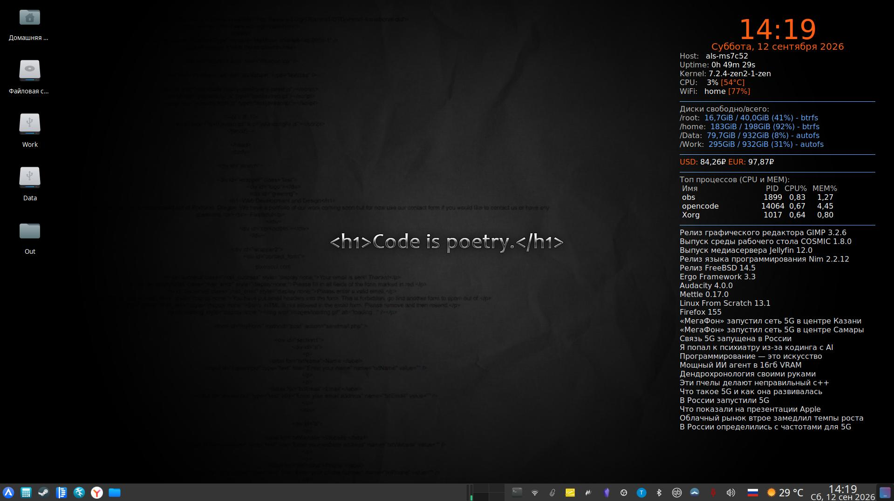

# dotfiles

Рабочие конфигурационные файлы (dotfiles) пользователя `als` + скрипт автоматической установки.
Единый набор настроек для XFCE и альтернативных окружений/оконных менеджеров, унифицированные конфиги шеллов `fish` / `zsh` / `bash` и интеграция с AI-агентами.



## Установка

**Быстрая установка** (копирует файлы из `home/` в `$HOME`):

```bash
curl -fsSL https://raw.githubusercontent.com/als-creator/dotfiles/main/install-dotfiles.sh | sh
```

**Вручную:**

```bash
git clone git@github.com:als-creator/dotfiles.git ~/dotfiles
cd ~/dotfiles
bash install-dotfiles.sh --backup
```

Скрипт `install-dotfiles.sh` копирует содержимое `home/` (включая `.config` и скрытые файлы) в `$HOME` с сохранением структуры и прав (`cp -a`). Перед запуском рекомендуется просмотреть скрипт и при необходимости отредактировать.

## Содержимое

Структура репозитория:

```
home/
├── .zshrc              # zsh: алиасы, история, fzf, vcs_info
├── .bashrc             # bash: то же ядро, что и zsh/fish
├── .gitconfig
├── .nanorc
├── .newsboat/          # RSS-ридер
├── .fonts/Terminus     # шрифт Terminus
├── .config/
└── .local/
    ├── bin/            # скрипты (login-autostart.sh, omarchy/)
    └── share/          # тема иконок kora-grey, omarchy shell/themes, Kotatogram
```

### Шеллы: fish / zsh / bash

Три шелла настроены единообразно (эталон — fish): один и тот же набор алиасов, функций и хоткеев fzf.
Алиасы `ai` (opencode) и `agent` (herdr) живут в `fish/conf.d/ai.fish` и в конфигах zsh/bash.

<details>
<summary><b>Общие команды и функции (все шеллы)</b></summary>

- **Git:** `add`, `commit`, `push`, `pull`, `log`, `diff`, `diffs`, `restore`, `clone`, `checkout`, `gs`/`stat`, `gc`, `gp`, `glo` (граф с ветками), `gco`
- **Система (Arch):** `syslog` (dmesg err/warn), `mirror` (reflector Россия, https), `clean` (pacman `-Sc` + `download-*`), `info`, `unlock` (умное снятие блокировки pacman), `grubconfig`
- **Обновление:** `sysup` — pacman/apt + Flatpak одной командой
- **Навигация:** `..`, `...`, `....`, `mkcd`, `d` (закладки каталогов)
- **Буфер обмена:** `c` (копия), `p` (вставка), `copypath` — автоопределение `wl-copy`/`xclip`
- **Поиск/просмотр:** `ff` (файл через fzf+fd, превью bat), `fcd` (переход в каталог), `h` (история), цветные `grep`/`egrep`/`fgrep`, `less -R`, `bat`/`batcat` + `MANPAGER` (`col | bat`, fallback `less -R`)
- **Полезное:** `ports` (`ss -tulpen`, fallback `netstat`), `ipinfo` (curl https), Go — единые `GOPATH/GOBIN/GOCACHE`, guard-ы для `yt-dlp`/`steamguard`/`inxi`

</details>

<details>
<summary><b>fzf и хоткеи шеллов</b></summary>

- **Ctrl+R / Ctrl+T / Alt+C / Shift+Tab** — история, файлы, переход в каталог, completion (fzf `--walker`, авто `wl-copy`/`xclip`)
- **Внутри fzf:** `Ctrl+Y` — копия результата, `Ctrl+X` — удаление файла, `Ctrl+D/U` — превью, `Ctrl+L` — очистка
- **zsh:** `Ctrl+[A]`/`Ctrl+[B]` — поиск по истории стрелками; git-статус в промпте (vcs_info); zoxide/uv/direnv
- **fish:** двухстрочный промпт `┌─…/└─>` с статусом последней команды и git-веткой

</details>

### AI-интеграция: opencode и herdr

- **`opencode`** — терминальный ассистент (CLI ИИ-агент), запуск через хоткеи и алиас `ai`
- **`herdr`** — менеджер ИИ-агентов (tmux-подобный интерфейс, префикс `Ctrl+Space`), алиас `agent`
- Конфиги: `.config/opencode/opencode.json` (провайдеры/модели), `.config/herdr/config.toml`

### Оконные окружения и менеджеры

Основное окружение — **XFCE 4.20**; для других DE/WM зеркалируются те же хоткеи и автозапуск.

<details>
<summary><b>Общий набор хоткеев (E/Launcher/Browser/File manager/Editor/AI/скрины/громкость)</b></summary>

| Комбинация | Действие |
|---|---|
| `Super+Return` | терминал `foot` |
| `Super+Space` | launcher `rofi -show drun` (в GNOME — `Super+Space`) |
| `Super+Shift+Return` | браузер `firefox` |
| `Super+E` | файловый менеджер `thunar` |
| `Super+Y` | редактор `code --unity-launch` |
| `Super+A` / `Super+ф` | **opencode** (`foot -e opencode`) |
| `Super+Ctrl+Return` | **herdr** (`foot -e herdr`) |
| `Print` | скрин: `flameshot full` (X11) / `grim` (Wayland) |
| `Shift+Print`, `Ctrl+F12` | скрин выделенной области |
| `XF86AudioRaise/LowerVolume`, `XF86AudioMute` | громкость `pactl ±5%` |
| `XF86MonBrightnessUp/Down` | яркость `brightnessctl ±5%` |

</details>

#### XFCE (рабочее)

- Настройки: `xfconf/` (клавиатура, панель, рабочий стол, thunar, приложения по умолчанию)
- Пользовательские хоткеи включают AI-биндинги (`Super+A`, `Super+Ctrl+Return`), `F12` — выпадающий терминал
- Автозапуск: opencode/herdr не автозапускаются; в `autostart/` — conky, obsidian, obs-tray, qbittorrent, radiotray-ng, xfce4-clipman, xfce4-notes, Kotatogram

#### Hyprland + omarchy

- `hypr/` — конфиг Hyprland (Lua): `monitors.lua`, `input.lua` (раскладки ru/us, NumLock), `bindings.lua`, `looknfeel.lua`, `autostart.lua` (conky, obsidian, obs, qbittorrent, radiotray-ng, telegram, kotatogram, blueman, flameshot), `xdph.conf`, `hyprsunset.conf`
- `.local/bin/omarchy/` — скрипты omarchy (`omarchy-menu-*`, `omarchy-launch-*`, `omarchy-restart-*` и др.)
- omarchy shell/темы — catppuccin, hackerman, tokyo-night

#### i3 / sway / bspwm+sxhkd / openbox

Полные конфиги оконных менеджеров с теми же хоткеями. Wayland-версии (sway) используют `grim`+`slurp` для скринов.

<details>
<summary><b>i3 (X11) и sway (Wayland) — ключевые привязки</b></summary>

- `$mod+Return` терминал, `$mod+Space` launcher, `$mod+Shift+Return` firefox, `$mod+E` thunar, `$mod+Y` code, `$mod+A` opencode, `$mod+Ctrl+Return` herdr
- `$mod+q` закрыть, `$mod+f` полный экран, `$mod+v`/`$mod+s`/`$mod+t` layouts
- Навигация: `$mod+←→↑↓` фокус, `$mod+Shift+←→↑↓` перемещение
- Рабочие столы: `$mod+1..9`, `Print`/`Shift+Print`/`Ctrl+F12` скрины
- i3status: CPU, память, громкость, диск `/`, батарея, часы (Asia/Omsk)

</details>

<details>
<summary><b>openbox (X11) — ключевые привязки</b></summary>

- `W-Return` терминал, `W-space` root-menu, `W-r` rofi, `W-S-Return` firefox, `W-E` thunar, `W-Y` code, `W-A` opencode, `W-C-Return` herdr
- `W-q` закрыть, `W-f` fullscreen, `W-z` maximize, `W+←→↑↓`/`W-S-←→↑↓` движение к краям
- `W-1..9` рабочие столы; скрины через `Print`/`S-Print`/`C-F12`

</details>

#### GNOME и KDE Plasma

Конфиги для двух других DE с теми же хоткеями:

- **GNOME:** `.config/gnome/apply-xfce-settings.sh` — применяет те же кастомные биндинги через gsettings (требует фиксации `custom-keybindings`)
- **KDE:** `.config/khotkeysrc` — 9 «Custom Shortcuts» (терминал, launcher, браузер, файловый менеджер, редактор, opencode, herdr, скрин, блокировка); Plasma импортирует файл при логине

### Панель и виджеты

- **waybar** (`.config/waybar/`) — для Hyprland/WM: launcher, calc, apps, workspaces, CPU/память, tray, звук, погода, раскладка, часы; правый клик — `wlogout`
- **conky** (`.config/conky/conky.conf`) — часы + информация о системе (top_right)
- **xfce4-panel** — штатная панель XFCE с плагинами

### Терминалы

- `alacritty.toml`, `kitty.conf`, `ghostty/config`, `foot/foot.ini`, `tilda`, `guake`, `konsolerc`, `yakuakerc`, `xfce4-terminal` (через панель)
- **tmux** (`.config/tmux/tmux.conf`) — префикс `Ctrl+Space`, режим `copy-mode-vi`, split по `h`/`v`, навигация `Ctrl+Alt+←→↑↓`, AI-панки: `prefix A` — opencode, `prefix a` — herdr, многие бинды описаны и доступны через `?`

### Приложения

Конфиги приложений: `opencode`, `herdr`, `nvim` (lazyvim), `starship.toml`, `bat`-превью, `btop`, `fastfetch`, `neofetch`, `geeqie`, `imv`, `qimgv`, `viewnior`, `mpv`/`smplayer`/`qmmp`, `pyradio`, `radio-cli`/`radiotray-ng` (закладки радио), `obs-studio` (сцены, rtmp-сервисы), `gpu-screen-recorder`, `flameshot`, `obsidian`, `joplin-desktop` (настройки/плагины), `kate`/`kdevelop`, `mc`, `mousepad`, `vcmi`, `xournalpp`, `fcitx5`, `wireplumber`, `chromium-flags.conf` (пароли в `gnome-libsecret`), `byedpi.conf`, `zed`, VS Code (`Code`, `Code - OSS`, `VSCodium`, `.vscode`) и др.

### Шрифты и иконки

- Шрифт **Terminus** в `~/.fonts/Terminus` (удалите, если есть пакетный)
- Тема иконок **kora-grey** в `~/.local/share/icons/kora-grey`
- Тема оформления XFCE (`gtk-3.0/` — цвета и CSS)

### Автозапуск для WM/DE

`.local/bin/login-autostart.sh` — общий безопасный автозапуск для оконных менеджеров (умные проверки установленных программ); вызывается из конфигов i3, sway, bspwm, openbox.
